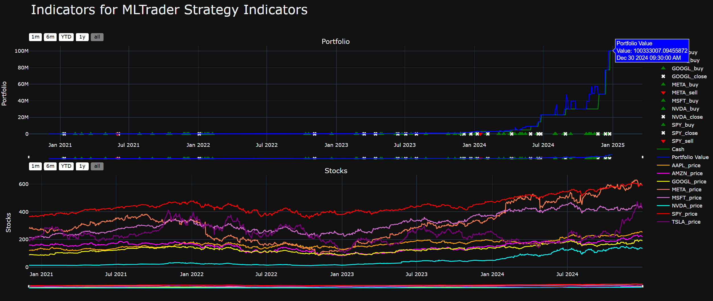

# Multi-Asset ML Trading Bot


This algorithmic trading framework combines machine learning and sentiment analysis for multi-asset trading strategies.

---

## Overview

This Multi-Asset ML Trading Bot is a modular, end-to-end algorithmic trading framework designed for both research (with backtesting) and practical deployment via paper or live trading. It combines machine learning, sentiment analysis, and technical analysis to create dynamic, data-driven trading strategies for multiple assets.

Built on the robust LumiBot library, which provides advanced strategy support out of the box, this bot leverages multi-output regression models to forecast 5-day average, minimum, and maximum prices for each asset, while integrating the FinBERT transformer model for financial news sentiment analysis.

Technical indicators such as RSI, MACD, Bollinger Bands, and ATR are used for advanced feature engineering and rigorous risk management.  
All trades are logged in detail for full auditability and analysis.

The project supports historical backtesting out of the box, with a clear path to enable live and paper trading.  
This trading bot provides a strong foundation for developing, testing, and scaling sophisticated trading strategies in Python.


---

## Setup Instructions

1. **Clone the repository:**

    ```bash
    git clone https://github.com/alanvinuv/tradingbot.git
    ```

2. **Set up the Python environment:**

    ```bash
    python -m venv venv
    # On Windows:
    venv\Scripts\activate       
    # On Linux or macOS:    source venv/bin/activate
    pip install -r requirements.txt
    ```

3. **Configure your environment variables:**

    - Copy `.env.example` to `.env`:

        ```bash
        # On Windows:
        copy .env.example .env
        # On Linux or macOS:    cp .env.example .env
        ```
    - Fill in your Alpaca API credentials in the `.env` file:
      ```
      APCA_API_KEY= "your_key_here"
      APCA_API_SECRET= "your_secret_here"
      APCA_BASE_URL = "base_url"
      ```

4. **Run the trading bot:**

    ```bash
    python trading_bot_multistock.py
    ```

    - Backtesting results and trade logs are saved in the `/outputs` folder of the project directory.
    - See inline comments in the code for configuration options.

> **Tip:**  
> You can also run the single-stock version using `python trading_bot.py`

---

## Project Structure

```markdown 
tradingbot/
├── data_example/               # Example SP500 data
│   └── sp500.csv
│
├── models/ # Trained ML models
│   ├── linear_model_5d_price.pkl
│   └── models_per_stock_fd.pkl
│
├── outputs/                    # Outputs of Single and Multistock bot
│   ├── multi_stock      
│   └── single_stock
│ 
├── research/                   # Notebooks & prototypes
│   ├── Prediction_model.ipynb
│   └── app_demo.py
│
├── .env.example                # Example for environment variables
├── requirements.txt            # Python dependencies
├── finbert_utils.py            # Sentiment analysis functions
├── trading_bot_multistock.py   # Main multi-stock trading script
├── trading_bot.py              # single-stock trading script
└── README.md                   # This file
```
**Model Files Explained**
- `/dataexample` - This folder contains S&P500 data which was downloaded from **Yahoo Finance**
- `/models/` – This folder contains pre-trained models used by the bot.
    - `linear_model_5d_price.pkl` – Regression model and predictors for predicting 5-day high/low/average price.
    - `models_per_stock_FD.pkl` – Dictionary of Regression models and predictors for each stock in the multi-stock strategy.
- `/outputs` – Stores results and visual reports generated after backtesting the trading bots.
    - `/multi_stock/` – Outputs from the Multi-Stock trading bot.
        - `tearsheet.html` – Performance tearsheet/report generated by backtesting.
        - `trade_charts.html` – Charts visualizing trades and portfolio value over time.
        - `trade_ledger.csv` – CSV log of all trades executed by the multi-stock bot.
    - `/single_stock/` – Outputs from the Single-Stock trading bot.
        - `tearsheet.html` – Performance tearsheet/report for the single-stock strategy.
        - `trades.html` – Charts showing trades and portfolio value.
- `/research/` – Notebooks and prototype scripts for modeling and experimental analysis.
    - `Prediction_model.ipynb` –  This notebook documents the experimentation and selection process for the price prediction models used in the trading bot. The workflow include:
        - Classification Models: 
          - Tested approaches like Logistic Regression and Random Forest to classify market movements (The labels were up/down recorded as 1/0, to invest or not).
        - Regression Models:  
          - Explored Random Forest Regressor, Support Vector Regression (SVR), and Linear Regression for predicting price levels (Close price of each day).
        - Feature Engineering:  
          - Systematically selected and tested various technical indicators and engineered features, ultimately identifying the following as the most informative predictors:  
            `["Open_Price", "RSI", "MACD_diff", "bollinger_pct", "Close_Ratio_5", "Trend_5", "Close_Ratio_250", "Trend_250"]`
        - Label Engineering:  
          - Experimented with various target variables, including:
            - Discrete classes (e.g., buy/hold/sell),
            - Daily closing prices,
            - 5-day average prices and returns.
          - Found that **5-day average price** (along with minimum and maximum prices) provided a meaningful balance.
        - Multi-Output Regression: 
          - Used Scikit-learn’s `MultiOutputRegressor` to predict the 5-day minimum, average, and maximum closing prices for each asset.
        - Time Series Models & Advanced Approaches:  
          - Tested ARIMAX (AutoRegressive Integrated Moving Average with exogenous variables), Transformer-based models, and Facebook Prophet for time-series forecasting.
          - Compared these advanced models to the simpler multi-output linear regression approach.
        - Model Selection Rationale: 
          - After benchmarking all models and considering interpretability, speed, and generalization, the notebook concludes that a **multi-output linear regression model** is currently the best fit for the trading bot, due to its simplicity, transparency, and strong real-world performance in out-of-sample testing. However, more advanced models such as transformers may yield superior results with further tuning and experimentation.
          - The ARIMAX model also produced competitive results; however, the multi-output linear regression approach offers similar performance with greater simplicity and interpretability, making it the preferred choice for this implementation.

        - **Packaging for Production:**  
          - The notebook demonstrates saving trained models and selected predictors for each stock, packaging them into `.pkl` files for use by the trading bot.

    - `app_demo.py` –  
        - Prototype/demo script for integrating both the prediction model and sentiment analysis (using FinBERT) with a FastAPI endpoint.  
        - Serves as a proof-of-concept for how the machine learning pipeline can be exposed as an API for programmatic access, automation, or dashboard integration.
- `.env.example` –  Example environment file listing the required environment variables (such as API keys and secrets) needed to run the project.  
Copy or rename this file to `.env` and fill in your own credentials.

- `finbert_utils.py` –  Utility module for performing sentiment analysis on news headlines or articles using the FinBERT transformer model.

- `README.md` –  Main project documentation. Includes setup instructions, usage examples, folder structure, and an overview of the project.

- `requirements.txt` –  List of all Python dependencies required to run the project. Use this to install all dependencies.

- `trading_bot.py` –  The main script for running the **single-stock trading bot**. Supports trading and backtesting on a single ticker using ML-based predictions and sentiment analysis.

- `trading_bot_multistock.py` –  The main script for running the **multi-stock trading bot**. Supports trading and backtesting across multiple tickers using ML-based predictions and sentiment analysis.

---

## Libraries

- **lumibot**  : An algorithmic trading framework that simplifies the creation, backtesting, and deployment of trading bots. Provides broker integration and event-driven strategy support.

- **ta** : Technical analysis library for Python. Offers a comprehensive set of indicators (like RSI, MACD, Bollinger Bands, ATR) for quantitative finance and trading strategies.

- **joblib** : Utility for efficient serialization and deserialization of Python objects, especially machine learning models. Used for saving and loading trained models.

- **python-dotenv** : Loads environment variables from a `.env` file, helping you securely manage API keys and configuration settings.

- **pandas** : Powerful data analysis and manipulation library.

- **alpaca-py** : Official Python SDK for the Alpaca brokerage API, allowing programmatic trading, account management, and data access.

- **yfinance** : Fetches historical market data from Yahoo Finance. Used to gather price data for feature engineering and backtesting.

- **scikit-learn** : Comprehensive machine learning library for regression, classification, data preprocessing, and model evaluation.

- **matplotlib** : Widely used plotting library for generating data visualizations, including price charts, indicators, and backtest results.

- **transformers** : Hugging Face’s NLP library. Used to load and run transformer models (like FinBERT).

- **torch** : Deep learning framework providing tensor computation and model support. Required for running models in `transformers`.

- **numpy** : The core numerical computing library for Python. Supports fast operations on arrays and matrices.

- **matplotlib** : Widely used plotting library for generating data visualizations, including price charts, indicators, and backtest results.

- **statsmodels** : Library for statistical modeling and time series analysis. Used here for ARIMAX forecasting model. Used in advanced model experimentation.

- **prophet** : Facebook’s open-source tool for forecasting time series data. Used in advanced model experimentation.

---

## Architecture

### Core Trading Engine

- **LumiBot Integration**  
  The core trading logic is built on [LumiBot](https://lumibot.lumiwealth.com), enabling both backtesting (with historical simulation) and live trading execution.  
  - Supports equities and ETFs in a multi-asset portfolio.
  - Event-driven: strategies are triggered by new data/events (e.g., daily close).
  - Easily switch between backtesting, paper trading and real trading with minimal code changes.

### Machine Learning Pipeline

- **Price Forecasting Model**
  - Utilizes a **multi-output linear regression model** to predict 5-day price ranges (minimum, average, maximum) for each asset.
  - Inputs include historical OHLCV data and engineered features from technical indicators.
  - Trained models and their predictors are serialized in `/models` for fast, modular loading.

### Sentiment Analysis Module

- **FinBERT Implementation**
  - Employs the FinBERT NLP transformer model for financial sentiment analysis.
  - **Data Source:**  
    - News headlines and earnings reports are fetched directly from the **Alpaca News API** via the `NewsClient` and `NewsRequest` classes.
    - These headlines are processed with FinBERT (See `finbert_utils.py`) to output a sentiment score (positive, neutral, negative) and confidence.
    - Sentiment is incorporated alongside price forecasts for a more robust trading signal, helping the bot adapt to breaking news or major events.

### Technical Framework

- **Feature Engineering**  
    - The price prediction model uses a carefully selected set of engineered features for each asset. The final predictors chosen for forecasting the 5-day average, minimum, and maximum prices are:
        - `Open_Price`: The opening price of the current trading day, providing context for daily price movement.
        - `RSI` (Relative Strength Index): A momentum indicator that measures recent gains vs. losses to identify overbought or oversold conditions.
        - `MACD_diff` (MACD histogram difference): The difference between the MACD line and its signal line, highlighting changes in bullish or bearish momentum.
        - `bollinger_pct` (Bollinger Band percentage position): Shows where the current price falls within the Bollinger Bands (between the upper and lower band), indicating relative position and volatility.
        - `Close_Ratio_5`: The current closing price divided by the 5-day moving average, capturing short-term momentum relative to recent history.
        - `Trend_5`: The number of days out of the last 5 where the closing price increased compared to the previous day, summarizing short-term trend direction.
        - `Close_Ratio_250`: The current closing price divided by the 250-day moving average, highlighting long-term price positioning relative to a full trading year.
        - `Trend_250`: The number of days out of the last 250 where the closing price increased compared to the previous day, providing a long-term trend signal.

    - These features are generated using rolling window calculations and technical analysis, allowing the model to capture both short-term momentum and long-term trend behavior.


- **Risk Management (Coded Logic)**
  - All risk management logic is coded within the strategy:
    - **Dynamic position sizing:** Calculates trade sizes based on account balance, ATR (current market volatility), and user defined cash-at-risk tolerance.
    - **Bracket orders:** Each trade is protected with simultaneous stop-loss and take-profit orders.
    - **Exposure controls:** Limits on maximum allocation per trade/asset to prevent over-concentration and excessive risk.
    - All parameters are easily adjustable in code for flexible risk tolerance.

---

### Visual Architecture Overview

```text
      +-----------------------------+
      |    Data Ingestion Layer     |
      |   (Yahoo, Alpaca APIs)      |
      +--------------+--------------+
                     |
                     v
        +------------+------------------+
        |                               |
        |                +-----------------------------+
        |                |  Feature Engineering Layer  |
        |                | (OHLCV + Technical Indics.) |
        |                +--------------+--------------+
        |                               |
        |                               |
        |                               |
        |                               v
+---------------------+    +---------------------+
| Alpaca News Client  |    |   Price Prediction  |
+---------+-----------+    |      (ML Model)     |
          |                +---------------------+
          v                             /
+---------------------+                /
| Sentiment Analysis  |               /
|     (FinBERT)       |              /
+---------------------+             /
        \                          /
         \                        /
          +----------------------+
          |                      |
          v                      v
      +------------------------------+
      |   Risk Management Logic      |
      | (Position sizing, stops,     |
      |  exposure, decision logic)   |
      +--------------+---------------+
                     |
                     v
            +--------------------+
            |   Trade Engine     |
            |    (LumiBot)       |
            +--------------------+
```
> Notes: 
> - **No live trading is enabled by default**. Live and paper trading can be enabled by switching broker configuration, but this **has not yet been tested in this version**. The bot currently runs in backtesting mode by default, but you can easily enable live or paper trading.

---

## Backtesting

The trading bot framework is extensively tested via backtesting using LumiBot and historical data from Yahoo Finance. This enables:

- Evaluation of strategy performance across different time periods and market regimes.
- In-depth review of all trades made during backtesting (saved in `/outputs/multi_stock` and `/outputs/single_stock`).

> ## Outputs
>
> ### 1. Single Stock Backtesting (trading_bot.py)
>
> 
>
> _Above: Single-Stock backtesting trade chart report from 2020-12-01 to 2024-12-31._
>
> ---
>
> ### 2. Multi-Stock Backtesting (trading_bot_multistock.py)
>
> 
>
> _Above: Multi-Stock backtesting trade chart report from 2020-12-01 to 2024-12-31._
>
> ---
>
> **How to review backtesting results:**
>
> - View performance plots in `trades.html`.
> - Open `tearsheet.html` in your browser for an interactive summary.
> - For multi-stock bot, examine `trade_ledger.csv` in Excel or pandas for a full trade-by-trade audit and `indicators.html` for custom plot.


---

## Future Works

Planned improvements and possible research directions for this trading bot includes:

- **Live & Paper Trading:**  
  - Further develop logic and monitoring for robust live and paper trading, including real-time data feeds and automated risk controls.

- **API & Dashboard:**  
  Expand the FastAPI integration (as demonstrated in `research/app_demo.py`) to serve predictions and trading analytics as a live REST API.  
  - `app_demo.py` demonstrates how the prediction model and sentiment logic can be exposed as an API endpoint using FastAPI for integration and extensibility.
  Build an interactive dashboard for monitoring trades, sentiment, and strategy performance in real time.

- **Scalability & Deployment:**  
  - Containerize the project with Docker for reproducible deployment.
  - Add CI/CD workflows and consider orchestrating with Kubernetes for production use.

- **Enhanced Strategies:**  
  - Conduct further Experiments with advanced ML models (LSTM, Transformers).
  - Incorporate new features from fundamental or alternative data sources.
  - Test additional risk management techniques and trade automation logic.

- **Conversational & Autonomous Agents:**  
  - Later, integrate with frameworks like [LangChain](https://python.langchain.com/) or [LangGraph](https://langchain-ai.github.io/langgraph/) for building intelligent trading assistants or multi-agent pipelines.  
  - This could allow users to interact with the trading bot via natural language, automate complex decision-making, and coordinate multiple agents (e.g., analyst, strategist, executor) for advanced, autonomous trading workflows.


- **Monitoring & Alerts:**  
  Add notifications for significant trading events, risk breaches, or system status updates via email, Slack, or Telegram.

---

## Credits

- **Lead Developer:** Alan Varghese Vinu
- **Sentiment Analysis:** [FinBERT by ProsusAI](https://huggingface.co/ProsusAI/finbert)
- **Trading Framework:** [LumiBot](https://lumibot.lumiwealth.com)
- **Broker Integration:** [Alpaca Markets](https://alpaca.markets/)
- **Technical Indicators:** [TA-Lib/ta](https://technical-analysis-library-in-python.readthedocs.io/)
- **Machine Learning Libraries:** [scikit-learn](https://scikit-learn.org/), [transformers](https://huggingface.co/transformers/), [prophet](https://facebook.github.io/prophet/docs/installation.html)

- **Special Thanks:**  
  [MLTradingBot by NickNochnack](https://github.com/nicknochnack/MLTradingBot)  
  [Dataquest S&P 500 Project](https://github.com/dataquestio/project-walkthroughs/tree/master/sp_500)  
  [Deep Learning Attention Examples by meanxai](https://github.com/meanxai/deep_learning/tree/main/11.Attention)  
  ...and to the open-source community who made rapid prototyping and research possible.


---
